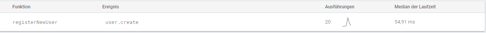
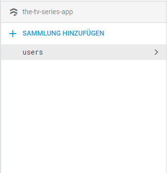
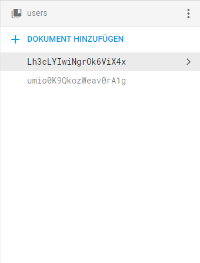
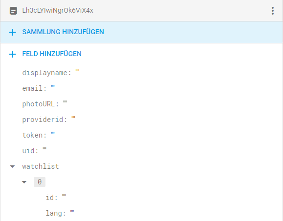
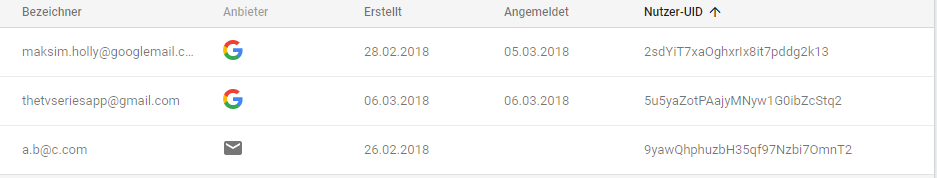

# Firebase

Wir benutzen den Service Google Firebase aus einer Vielzahl an Gründen, welche wir im folgenden auflisten werden. Um mit diesem Dienst zu interagieren, schickt die App HTTP-Anfragen an unseren Server. Eine vollständige Dokumentation zu diesen lässt sich [hier](server.md#endpunkte-f%c3%bcr-den-server) finden. Serverseitig benutzen wir das node.js Modul ["firebase-admin"][admin].

## Cloud Functions

Cloud Function sind in der Praxis Methoden, welche bei bestimmten Ereignissen ausgeführt werden. Um neue Nutzende effizient in unserer Datenbank (Cloud Firestore) zu speichern, entschieden wir uns eine Cloud Function zu benutzen. Diese reagiert auf das Ereignis user().onCreate, also auf die Erstellung eines neuen Nutzenden. Daraufhin werden bestimmte Daten des neu registrierten Nutzenden in der Datenbank gespeichert.

_Abb. zeigt die Cloud Function in der Firebase Console_

## Firestore

Um die Daten von Nutzenden zu speichern, benutzen wir den Service Firestore, welcher von Google Firebase anbgeboten wird. Die Struktur unserer Daten sieht folgendermaßen aus:

Die oberste Ebene bildet eine sogenannte Sammlung.

In unserem Fall nannten wir diese "user" (zu dt. Nutzer).

Eine Sammlung setzt sich zusammen aus vielen Dokumenten.

Wir entschieden uns nicht-deskriptive Namen für die einzelnen Dokumente zu wählen, um Dopplungen und andere Fehleranfälligkeiten zu vermeiden.

Ein Dokument wiederum besteht aus Feldern. Diese können Strings, Nummern, booleans, Objekten, Arrays, Nulls, Timestamps (zu dt. Zeitpunkt/Zeitstempel), Geopoints oder Referenzen auf andere Dokumente seien.

Wir entschieden uns displayname, email, photoURL, providerId, token und uid als Strings zu speichern. Die Watchlist eines Nutzers speichern wir als Array, welcher sich aus Objekten zusammensetzt. Diese Objekte haben zwei Attribute: id und lang. Diese stehen für die ID der gespeicherten Serie und die Sprache, in welcher diese gespeichert ist.

## Authentification

Wir benutzen außerdem den Authentification (zu dt. Authentifizierung) Service von Google Firebase. Dieser erlaubt es uns die Authentifizierung innerhalb der App wesentlich einfacher zu gestalten. Einerseits können sich Nutzer über eine Kombination aus E-mail und Passwort registrieren, andererseits können sie aber auch sogenannte social logins, wie Google oder Facebook benutzen.

Momentan unterstützen wir die Anmeldung und Registrierung via Email via und Google Account. Dabei wird jedem Nutzer automatisch eine einzigartige UID zugewiesen, welche im weiteren programmatsich verwendet werden kann.

_Abb. zeigt die Nutzerübersicht in der Firebase Console_

## FCM

[admin]:https://firebase.google.com/docs/admin/setup

Damit Nutzer der App Benachrichtigungen erhalten können, muss der im Hintergrund laufende Benachrichtigungs-Service von Android angesprochen werden. Dies geschieht mithilfe von Firebase Cloud Messaging, einem Online-Service bereitgestellt von Google, welcher ein Framework für das Erstellen und Senden von [Push-Nachrichten](https://de.wikipedia.org/wiki/WAP-Push) bereitstellt.

