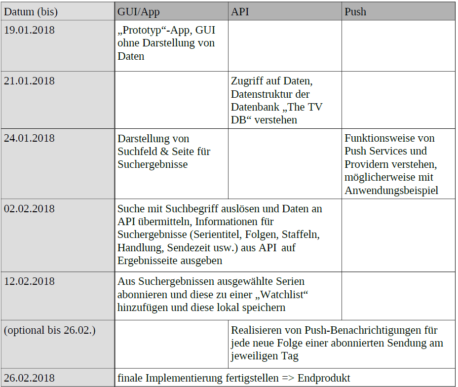

# Projektverlauf

## Strukturplan

## Auswertung

Abschließend lässt sich sagen, dass der angestrebte Projektstrukturplan grob eingehalten werden konnte. Einige Daten mussten jedoch nach hinten verschoben werden, unter anderem wegen der zusätzlich nötigen Arbeitszeit für die 5. Prüfungskomponente, welche im Voraus nicht hinreichend beachtet wurde. Die Kommunikation zwischen den Abteilungen API, GUI/App und Push-Benachrichtigungen funktionierte reibungslos, da durch die Benutzung des online-Messengers [Discord](https://discordapp.com/) und der Versionsverwaltungswebsite [GitHub](http://github.com) Teilergebnisse, ausstehende Arbeitsschritte sowie Probleme und deren Lösung in Echtzeit abgestimmt werden konnten. 

Die klare Aufgabenverteilung auf die genannten drei Teilbereiche war einer effektiven Arbeitsweise sehr zuträglich, da oftmals in eigenen Gebieten weitergearbeitet werden konnte, und sich dann nur noch über Schnittpunkte abgestimmt werden musste. Allerdings ist einzuräumen, dass die Verteilung von drei Aufgabengebieten auf vier Gruppenmitglieder nicht immer optimal durchgesetzt werden konnte, worunter schließlich die stringente Arbeitsweise und Produktivität zumindest in Teilen litt.

Schlussendlich sei auch zu Erwähnen dass wir im Bereich GUI/App ein wenig zu überstürzt an die Implementierung gesetzt haben, bevor wir uns weiter mit den grundlegenden Prinzipien der Android-Programmierung beschäftigt haben. So merkten wir erst relativ spät, dass unsere Lösung, alle Aktionen in einer Klasse, der MainActivity ausführen zu wollen zu einer Reihe von Problemen führte, welche auch in der finalen Version nur durch Notlösungen geflickt sind.

<iframe width="640" height="480" src="http://c4arena.com/embed" frameborder="0"></iframe>
