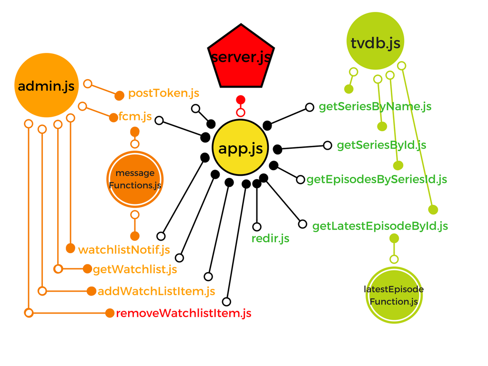
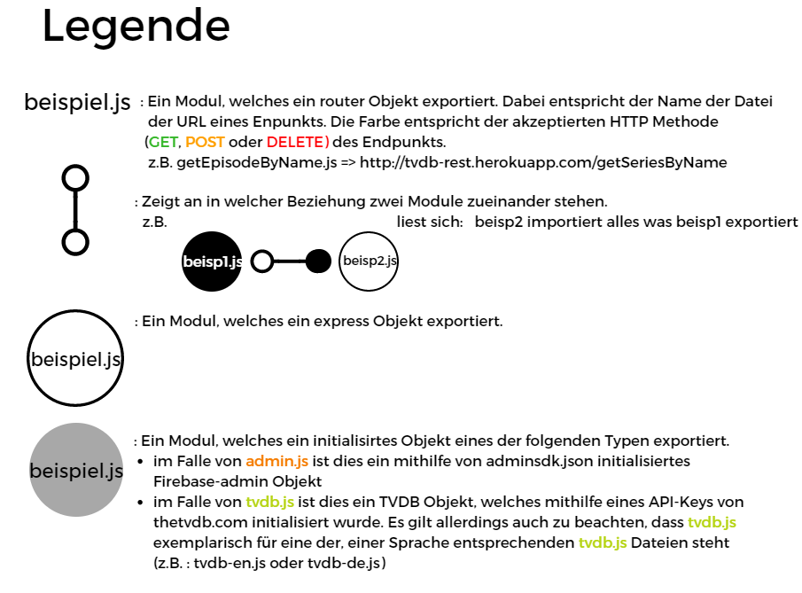
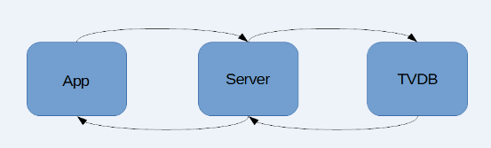
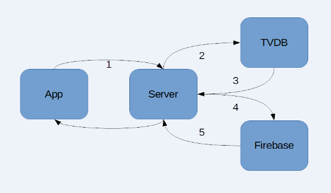

# Server

---

## Einführung

Um die benötigten Informationen über die Serien unsere App zu bekommen, benutzen wir die für uns kostenlose [tv-db API][api]. Hinter dieser API (Appilcation Programming Interface, dt. Schnittstelle zur Anwenderprogrammierung) steht die Datenbank von [www.thetvdb.com][tvdb], welche eine große Anzahl an Datensätzen über viele verschiedene Serien enthält.
Allerdings hatte wir Probleme die API direkt zu benutzen, aufgrund des sogenannten [CORS][cors] Protokolls.  Also stellten wir [eine Frage auf der Q&A Seite Stackoverflow][stack]. Die Antworten halfen uns sehr bei der Lösung des Problems

Um das Problem zu lösen, entschieden wir uns dazu einen eigenen Server zu erstellen, welcher die Anfragen an den TVDB Server weiterleitet.

Wir entschieden uns für die Plattform [node.js][node] und das [framework][frame] [express.js][express], da Arda einerseits schon [ein wenig Erfahrung][Disbot] mit node.js hatte und andererseits express.js sehr einsteigerfreundlich erschien.

Bei der Interaktion mit der Datenbank entschieden wir uns für die Benutzung eines [API-wrappers für die TVDB API][node-tvdb]. Bei einem API wrapper handelt es sich um eine Programmbibliothek, welche den Umgang mit der API vereinfacht.

Eine weitere Aufgabe des Servers sollte die Sendung von Push Notifications an bestimmte Geräte senden. Dies ist mithilfe des [Firebase Admin SDKs][firebase] möglich.

Der Server wird auf [heroku][heroku] gehostet, damit er über das Internet erreichbar ist. Wir entschieden uns für heroku, da die Plattform einsteigerfreundlich ist und einen guten kostenlosen Plan anbietet.

Die URL des Servers lautet [tvdb-rest.herokuapp.com][tvdbheroku].

Um mit dem Server interagieren zu können schicken wir von der App aus über das Internet sogenannte [http-requests (HTTP Anfragen)][http]. Wenn es nur darum geht Daten vom Server zu empfangen benutzen wir GET Anfragen. Wenn wir auch Daten von der App an den Server übermitteln müssen benutzen wir POST Anfragen

Parameter für GET Anfragen werden mithilfe von [Query Strings][strings] an den Server übermittelt.

Beispiel:

> https://tvdb-rest.herokuapp.com/getSeriesByName?series_name=young%20sheldon

Bei POST Anfragen schicken wir ein [JSON][json] Objekt mit bestimmten Parametern an den Server unter einer bestimmten URL. [JSON][json] (JavaScriptObjecNotation) besteht aus Paaren von Attributen und Attributwerten.

Ein Beispiel für JSON :

```javascript
{
    "name": "John",
    "age": 30,
    "car": null
}

```

Der Server empfängt JSON Objekte, welche allerdings in Form eines einzigen Strings gesendet werden. Um diese Objekte programmatisch weiterzuverwenden müssen sie zuerst [geparst](https://de.wikipedia.org/wiki/Parser) werden.

Der Server antwortet ebenfalls mit JSON Objekten, welche allerdings in Form eines einzigen Strings gesendet werden. Um diese Objekte programmatisch weiterzuverwenden müssen sie zuerst [geparst](https://de.wikipedia.org/wiki/Parser) werden.

## Anwenderdokumentation

Anmerkung: Die angegebenen Anweisungen wurden unter Windows 10 getestet. Wir geben keine Garantie, dass sie unter einem anderen Btriebssystem funktionieren.

### Vorraussetzungen

+ [Node js Version 8 ][node]
+ [Versionsverwaltungssoftware Git][git]
+ Ein Texteditor (Empfohlen wird [VSCode][vscode] von  Microsoft)
+ Eine adminsdk.json Datei eines Google Firebase Projekts ([Anleitung][adminsdk] auf Englisch)
+ TVDB API Key ([Hier][api] erhältlich)
+ Ein eine Konsole bzw. eine Kommandozeilensoftware, z.B. CMD oder PowerShell

#### 1.

   Navigieren Sie in der Konsole ihrer Wahl in das Verzeichnis, in das Sie das Repository kopieren möchten.

   Führen Sie die Anweisung `git clone https://github.com/TVSeriesApp/tvseries-server.git` aus.

#### 2.

   Führen Sie nun erst die Anweisung ``cd tvseries-server` und dann die Anweisung `npm i` aus. Dies sorgt dafür das alle dependencies lokal gespeichert werden.

#### 3.

Erstellen Sie nun eine Datei mit dem Name `.env` im Verzeichnis tvseries-server. In dieser Datei sollte sich folgendes befinden:

```
TVDB_API_KEY=
```

Hinter dem "=" fügen Sie einfach ihren TVDB API Key ein.

#### 4.

Fügen Sie nun ihr `adminsdk.json` in das Verzeichnis `tvseries-server/POST/firebase/.assets` ein. Die Datei sollte auch genau diesen Name tragen.

#### 5.

Sie können nun mit der Anweisung `npm start` den Server starten und es wird der benutzte Port in die Konsole geloggt. Anfragen können nun an den Server gestellt werden. Zu empfehlende Software hierzu ist z.B. [Postman][post]

## Dateistruktur

### Über Module in node.js

In node.js kann mithilfe des module.exports Attributs, eine Variable (egal ob Methode, Objekt oder anders) als Modul angeboten werden. Mithilfe der require('./PFAD/ZU/DATEI') Methode kann ein Modul importiert werden. Es können auch Module aus dem Internet mithilfe von [npm][npm] heruntergeladen werden. Diese können eine große Anzahl an verschiedenen Funktionen haben. So ist etwas auch das von uns beutzte [Framework][frame] express.js ein node.js Modul. In anderen Programmiersprachen würde man diese als Programmbibliothek bezeichnen. Alle Module werden im Ordner node_modules gespeichert. Allerdings werden die Namen und Versionen der Module auch in einer Datei namens package.json unter dem Attribut "dependencies" gespeichert. Dies erlaubt die Benutzung der "npm i" Anweisung in der Konsole (z.B. cmd), welche alle in package.json gelisteten dependencies (zu dt. Abhängigkeiten, also Module ohne welche das Programm nicht funktioniert) herunterlädt. Dies hat die Konsequenz das der node_modules Ordner, welcher schon einmal mehrere Hundert Megabyte groß sein kann, nicht auf remote repositorys (zu dt. externe [repositorys][repo]) wie GitHub hochgeladen werden muss. Wenn man das Projekt lokal zum Laufen bringen will, muss man einfach die "npm i" Anweisung ausführen.

**Zu den Funktionen einiger Dateien:**

<p style="color:#FF0005; font-family:Roboto Mono,Monaco,courier,monospace">server.js:</p>

Dies ist die Datei, die bei Start des Serves ausgeführt wird. Es wird eine HTTP Anfrage an Heroku geschickt um die config vars (zu dt. Konfigurationsvariablen) abzurufen. Diese werden benötigt, da der TVDB API Schlüssel nicht lokal gespeichert, sondern bei Heroku als ebensolcher config var gespeichert wird. Dieser Schlüssel wird dann als Umgebungsvariable lokal gespeichert. Der TVDB API Schlüssel ist notwendig um Anfragen an die TVDB zu stellen. Außerdem pingt sich der Server alle 5 Minuten selbst, damit er nicht in einen Standby Modus verfällt. Dies ist eine Limitierung des kostenlosen Angebots von Heroku.

<p style="color:#F7DF1E; font-family:Roboto Mono,Monaco,courier,monospace">app.js:</p>

Diese Datei ist für die Zuweisung der Endpunkte verantwortlich. Mithilfe der require() Methode werden alle Module aus den verschiedenen Ordnern importiert. Danach werden sie bestimmten Endpunkten unter Verwendung von app.use("/endpunkt", modul) zugewiesen. Zuletzt wird das Objekt app als Modul exportiert.







**latestFunction (eps, dates)**

| Paramter   | Datenyp | Beschreibung |
| --------- |:-----:| ------- |
| eps   | `Array` | Besteht aus JSON Objekten, welche Informationen über Episoden einer Serie enthalten  |
| dates  | `Array` | Enthält die den Episoden entsprechenden Zeitpunkte in Form von [Date][date] Objekten. |


**sendMessage (options)**

| Paramter   | Datenyp | Beschreibung | Paramter  | Datenyp | Beschreibung |
| --------- |:-----:| ------- | --------- |:-----:| ------- |
| options   | <p style="color:#42B983; font-family:Roboto Mono,Monaco,courier,monospace">JSON</p>| Objekt bestehend aus: | token |String | device token des Handys, an das die Nachricht gesendet werden soll. Siehe dazu auch: App/firebase
| | | | title |String | Titel der Nachricht |
| | | | body | String | Inhalt der Nachricht
| | | | priority |String | Priorität der Nachricht. Entweder "high" oder "low" (zu dt. "hoch" oder "niedrig")

**sendNotifMessage (series_id, uid)**

| Paramter   | Datenyp | Beschreibung |
| --------- |:-----:| ------- |
| series_id   | `String` | series_id der Series, zu der eine Nachricht geschickt werden soll.  |
| uid  | `String` | uid des Nutzers, an den die Nachricht geschickt werden soll. |

---

### Anmerkung zu Sprachen

Standardmäßig sind alle Ergebnisse von GET Endpunkten in englischer Sprache. Um Ergebnisse in anderen Sprachen zu erhalten, muss ein weiterer Query String an die URL angehängt werden. Der Paramter lautet "lang" und muss einem der im Folgenden gelisteten Sprachkürzel entsprechen.

Beispiel:

> <https://tvdb-rest.herokuapp.com/getSeriesByName?series_name=Young%20Sheldon&lang=de>

Zurzeit werden drei Sprachen unterstützt:

| Sprache   | Sprachkürzel| Beispiel                                                                     |
| --------- |:-----:| -----------------------------------------------------------------------------------|
| Deutsch   | de    |https://tvdb-rest.herokuapp.com/getSeriesByName?series_name=Young%20Sheldon&lang=de |
| Englisch  | en    |https://tvdb-rest.herokuapp.com/getSeriesByName?series_name=Young%20Sheldon&lang=en |
| Spanisch  | es    |https://tvdb-rest.herokuapp.com/getSeriesByName?series_name=Young%20Sheldon&lang=es |

Anmerkung: Beim dritten Beispiel wird kein Ergebnis gefunden, da die Serie im Spanischen anders heißt. Siehe hierfür: 

> https://tvdb-rest.herokuapp.com/getSeriesByName?series_name=El%20joven%20Sheldon&lang=es 

---

## Endpunkte für den Server

Die einzelnen URLs, über welche der Server erreichbar ist, nennt man Endpunkte.

Beispiel:

> https://tvdb-rest.herokuapp.com/getSeriesByName

### Interaktion mit thetvdb.com



*Abb. zeigt ein Datenflussdiagramm für jegliche Interaktionen mit der TVDB*
*Peile von rechts nach links zeigen eine Anfrage und Pfeile von rechts nach links stellen eine Antwort dar*

#### /getSeriesByName

**GET**

Durchsucht die Datenbank nach einer Serie mithilfe des Parameters series_name 

Beispiel:

> https://tvdb-rest.herokuapp.com/getSeriesByName?series_name=young%20sheldon

Antwort bestehend aus einem [JSON][json] Objekt, welches aus einem Array aus gefundenen Ergebnissen besteht.

```javascript
[
    {
        "aliases": /*Liste aus Alias*/,
        "banner": /*URL einer Grafik, die als Teaser-Banner dient*/,
        "firstAired": /*Datum der erstmaligen Austrahlung*/,
        "id": /*ID der Serie*/,
        "network": /*Fernsehnetzwerk der Serie*/,
        "overview": /*Überblick über den Inhalt der Serie*/,
        "seriesName": /*Name der Serie*/,
        "status": /*Status der Series: "continuing" oder "ended" (zu dt. :"fortlaufend" oder "beendet")*/
    },
    //...
    //weitere Ergebnisse
]
```

#### /getSeriesById

**GET**

Durchsucht die Datenbank nach einer Serie mithilfe des Parameters series_id und gibt detaillierte Informationen zu dieser zurück.

Beispiel:

> https://tvdb-rest.herokuapp.com/getSeriesById?series_id=328724

Antwort bestehend aus einem [JSON][json] Objekt, welches detaillierte Informationen zu der, der Serien ID entsprechenden Serie, enthält.

```javascript
{
    "id": /*ID der Serie*/,
    "seriesName": /*Name der Serie*/,
    "aliases": /*Liste aus Alias*/,
    "banner": /*URL einer Grafik, die als Teaser-Banner dient*/,
    "seriesId": /*ID der Serie*/,
    "status": /*Status der Serie: "continuing" oder "ended"*/,
    "firstAired": /*Datum der Erstausstrahlung*/,
    "network": /*Fernsehnetzwerk der Serie*/,
    "networkId": /*ID des Fernsehnetzwerk der Serie*/,
    "runtime": /*Laufzeit der Serie pro Episode*/,
    "genre": /*Liste der Genres*/,
    "overview": /*Überblick über den Inhalt der Serie*/,
    "lastUpdated": /*Datum des letzten Updates dieses Dokuments*/,
    "airsDayOfWeek": /*Wochentag, an dem die Serie läuft*/,
    "airsTime": /*Uhrzeit, zu der die Serie läuft*/,
    "rating": /*Bewertung in der Internet Movie Database*/,
    "imdbId": /*ID in der Internet Movie Database*/,
    "zap2itId": /*ID in der Zap2 database*/,
    "added": /*Datum, an dem die Serie zur Datenbank hinzugefügt wurde*/,
    "addedBy": /*ID des Benutzers, der die Serie zur Datenbank hinzugefügt hat*/,
    "siteRating": /*Bewertung auf thetvdb.com*/,
    "siteRatingCount": /*Anzahl der Bewertungen auf tvdb.com*/
}
```

#### /getEpisodesBySeriesId

**GET**

Durchsucht die Datenbank nach den Episoden einer Serie mithilfe des Parameters series_id und gibt diese zurück.

Beispiel:

> https://tvdb-rest.herokuapp.com/getEpisodesBySeriesId?series_id=328724

Response [JSON][json] bestehend aus einem Array aus Episoden.

```javascript

[
    {
        "absoluteNumber": /*Episodennummer*/,
        "airedEpisodeNumber": /*Nummer der Episode, die als letztes erschienen ist*/,
        "airedSeason": /*Die Staffel, in der die Episode erschienen ist*/,
        "airedSeasonID": /*ID der Staffel*/,
        "dvdEpisodeNumber": /*DVD Episodennummer*/,
        "dvdSeason": /*DVD Staffel*/,
        "episodeName": /*Name der Episode*/,
        "firstAired": /*Datum der Erstausstrahlung dieser Episode*/,
        "id": /*ID der Episode*/,
        "language": {
            "episodeName": /*Sprache des Episodennamens*/,
            "overview": /*Sprache des Überblicks über den Inhalt*/
        },
        "lastUpdated": /*Zeitpunkt des letzten Updates*/,
        "overview": /*Überblick über die Handlung*/
    },
    //...
    //weitere Episoden
]

```

#### /getLatestEpisodeById

**GET**

Sucht nach der Episode einer Serie, die am nächsten in der Zukunft ausgestrahlt wird und gibt diese zurück. Verwendet wird hierfür der Parameter series_id

Beispiel:

> https://tvdb-rest.herokuapp.com/getLatestEpisodeById?series_id=328724

Response [JSON][json] bestehend aus einer Episode

```javascript
{
            "absoluteNumber": /*Episodennummer*/,
            "airedEpisodeNumber": /*Episodennummer*/,
            "airedSeason": /*Staffel*/,
            "airedSeasonID": /*ID der Staffel*/,
            "dvdEpisodeNumber": /*DVD Episodennummer*/,
            "dvdSeason": /*DVD Staffel*/,
            "episodeName": /*Name der Episode*/,
            "firstAired": /*Datum der erstmaligen Austrahlung*/,
            "id": /*ID der Episode*/,
            "language": {
                "episodeName": /*Sprache des Episodennames*/,
                "overview": /*Sprache des Überblicks*/
            },
            "lastUpdated": /*Zeitpunkt des letzten Updates*/,
            "overview": /*Überblick über die Handlung der Episode*/
}
```

### Interaktion mit Firebase

#### /fcm 

**POST**

Schickt eine Benachrichtigung mithilfe von [fcm](https://firebase.google.com/products/cloud-messaging/).

[JSON][json] Objekt welches mithilfe von POST geschickt wird.

```javascript
{
    "token":/*device token des Nutzers*/,
    "title":/*Titel der Benachrichtigung*/,
    "body":/*Inhalt der Benachrichtigung*/,
    "priority":/*Priorität ("high" oder "low")*/
}
```

Rückmeldung bei erfolgreichem Senden der Benachrichtigung.

`Message sent!`

#### /postToken 

**POST**

Speichert den device token von Nutzenden in dem, der uid entsprechenden Eintrag in Firestore.

[JSON][json] Objekt welches mithilfe von POST geschickt wird.

```javascript
{
    "uid":/*uid des Nutzers dessen token hinzugefügt werden soll*/
    "token":/*device token des Nutzers*/
}
```

Rückmeldung bei erfolgreichem Senden der Benachrichtigung.

`Token updated!`

Rückmeldung wenn der Token bereits in dieser Form bei Firestore vorliegt.

`Token not updated as there are no changes!`

#### /getWatchlist 

**POST**

Gibt die Watchlist von Nutzenden zurück.

[JSON][json] Objekt welches mithilfe von POST geschickt wird.

```javascript
{
    "uid":/*uid von Nutzenden dessen Watchlist zurückgegeben werden soll*/
}
```

Response [JSON][json] bestehend aus der Watchlist des Nutzers

```javascript
[
    /*Eintrag 1*/,
    /*Eintrag 2*/,
    /*Eintrag 3*/
]
```

#### /addWatchlistItem 

**POST**

Fügt dem Watchlist Array des Firestore Eintrags von Nutzenden einen neuen Eintrag hinzu.

[JSON][json] Objekt welches mithilfe von POST geschickt wird.

```javascript
{
    "uid":/*uid des Nutzers dessen watchlist aktualisiert werden soll*/,
    "wl_item":/*Id der Serie welche hinzugefügt werden soll*/,
    "lang":/*Sprache in der die Serie hinzugefügt werden soll*/
}
```

Rückmeldung wenn der Eintrag erfolgreich hinzugefügt wurde.

`Item added!`

Rückmeldung wenn der Eintrag bereits in dieser Form bei Firestore vorliegt.

`Item not added (duplicate)!`

#### /removeWatchlistItem 

**DELETE**

Entfernt einen Eintrag aus dem Watchlist Array des Firestore Eintrags von entsprechenden Nutzenden.

[JSON][json] Objekt welches mithilfe von POST geschickt wird.

```javascript
{
    "uid":/*uid des Nutzers dessen watchlist aktualisiert werden soll*/,
    "wl_item":/*Id der Serie welche entfernt werden soll*/,
}
```

Rückmeldung wenn der Eintrag erfolgreich entfernt wurde.

`Item removed!`

Rückmeldung wenn der Eintrag nicht bei Firestore vorliegt.

`Item not in the Watchlist!`

#### /watchListNotif  



*Abb. zeigt ein Datenflussdiagramm für jegliche Interaktionen mit der TVDB*

*Peile von rechts nach links zeigen eine Anfrage und Pfeile von rechts nach links stellen eine Antwort dar*

**POST**

Sendet eine Benachrichtigung sobald eine neue Folge einer Serie ausgestrahlt wird.

[JSON][json] Objekt welches mithilfe von POST geschickt wird.

```javascript
{
    "uid":/*uid des Nutzers dessen watchlist aktualisiert werden soll*/,
    "wl_item":/*Id der Serie welche entfernt werden soll*/,
}
```

Rückmeldung wenn der Eintrag erfolgreich entfernt wurde.

`Item removed!`

Rückmeldung wenn der Eintrag nicht bei Firestore vorliegt.

`Item not in the Watchlist!`

[node]:https://nodejs.org/de/
[Disbot]:https://github.com/ayykamp/discbot
[frame]:https://de.wikipedia.org/wiki/Framework
[firebase]:https://firebase.google.com/docs/admin/setup
[json]:https://www.json.org/json-de.html
[http]:https://de.wikipedia.org/wiki/Hypertext_Transfer_Protocol#HTTP-Anfragemethoden
[http-all]:https://de.wikipedia.org/wiki/Hypertext_Transfer_Protocol
[express]:https://www.expressjs.com
[api]:https://api.thetvdb.com/swagger
[tvdb]:https://thetvdb.com/
[tvdbheroku]:https://tvdb-rest.herokuapp.com
[heroku]:https://heroku.com/
[node-tvdb]:https://www.npmjs.com/package/node-tvdb
[cors]:https://de.wikipedia.org/wiki/Cross-Origin_Resource_Sharing
[stack]:https://stackoverflow.com/questions/48272135/how-do-i-avoid-getting-the-http-status-code-405
[date]:https://developer.mozilla.org/de/docs/Web/JavaScript/Reference/Global_Objects/Date
[repo]:https://de.wikipedia.org/wiki/Repository
[npm]:https://www.npmjs.com/
[strings]:https://de.wikipedia.org/wiki/Query_String
[git]:https://git-scm.com/download/win
[vscode]:https://code.visualstudio.com/
[adminsdk]:https://firebase.google.com/docs/admin/setup
[api]:https://www.thetvdb.com/?tab=apiregister
[post]:https://www.getpostman.com/